<div align="center">

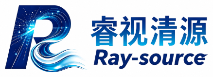

# Ray-Source · 睿视清源

**多模态检索增强（RAG）智能产品客服系统**

<em>Multimodal Retrieval-Augmented Generation for Grounded Product Support</em>

<br/>

[](#-荣誉)
[](#-荣誉)

<br/>


<br/>

<samp>图文问答　·　稀疏＋稠密双路召回　·　证据对齐防幻觉　·　全链路 RAG 可视化审计</samp>

<br/>

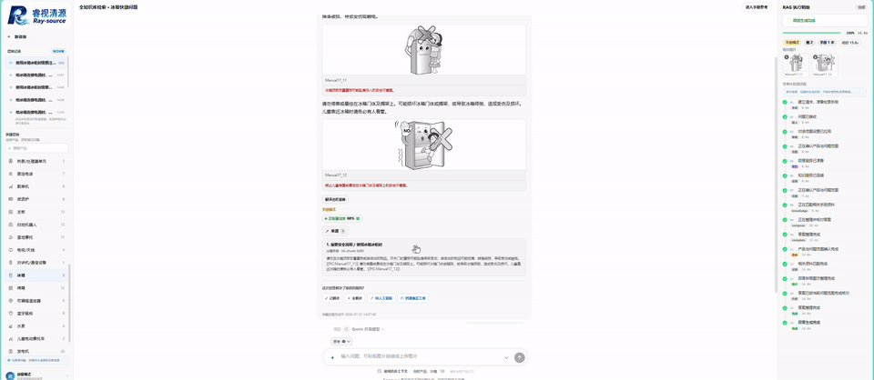

</div>

<br/>

<div align="center">

[✨ 简介](#-简介) &nbsp;·&nbsp; [🖼️ 预览](#-界面预览) &nbsp;·&nbsp; [🏗️ 架构](#-系统架构) &nbsp;·&nbsp; [🧩 技术栈](#-技术栈) &nbsp;·&nbsp; [🚀 快速开始](#-快速开始) &nbsp;·&nbsp; [📡 API](#-api-概览) &nbsp;·&nbsp; [🛠️ 知识运维](#-知识块管理) &nbsp;·&nbsp; [📁 结构](#-目录结构)

</div>

---

## ✨ 简介

**Ray-Source（睿视清源）** 是一套可独立部署的多模态智能产品客服系统。它以真实产品说明书（覆盖 **40 类**家电 / 数码 / 户外设备）为知识底座，将用户的**自然语言问题 + 上传图片**转化为**有据可依（grounded）**的图文答案 —— 每一段结论都可追溯到手册原文与配图，界面右侧实时展示完整的 RAG 检索链路。

> 🏆 本项目荣获 **中国研究生电子设计大赛（GEDC）国家级一等奖**，并获 **企业专项奖金 ￥40,000**。

<table>
<tr>
<td width="25%" align="center"><b>🛡️ 不编造</b><br/><sub>证据选择 + 答案对齐<br/>强校验抑制幻觉</sub></td>
<td width="25%" align="center"><b>🔍 看得见</b><br/><sub>右侧执行明细逐步<br/>展示完整检索链路</sub></td>
<td width="25%" align="center"><b>🖼️ 多模态</b><br/><sub>图片 / 链接输入<br/>视觉预路由 + 检索验证</sub></td>
<td width="25%" align="center"><b>⚙️ 可运维</b><br/><sub>可视化知识块管理<br/>一键切分发布热切换</sub></td>
</tr>
</table>

---

## 🖼️ 界面预览

### 桌面网页端 · 图文问答 ＋ RAG 全链路审计

<div align="center">
  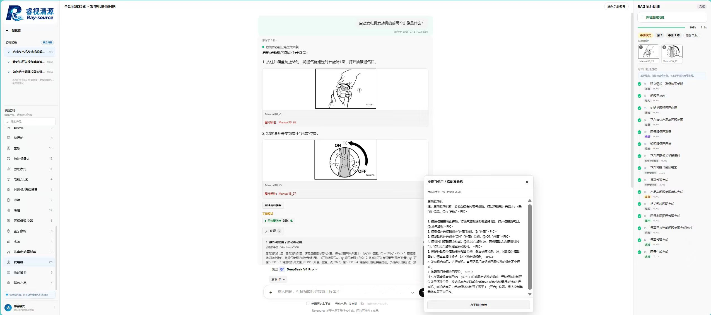
  <br/>
  <sub>左侧产品导航与会话历史　|　中部带手册配图的图文答案　|　右侧「RAG 执行明细」实时溯源</sub>
</div>

<br/>

### 核心能力速览

<div align="center">
<table>
  <tr>
    <td align="center" width="33%">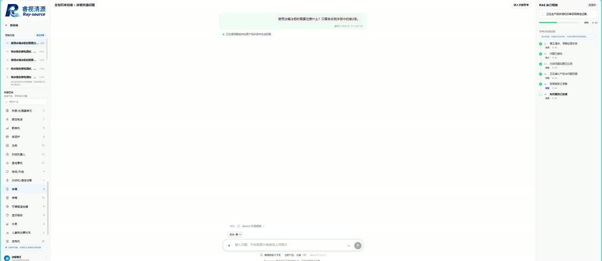<br/><sub><b>实时检索 · 执行明细</b></sub></td>
    <td align="center" width="33%">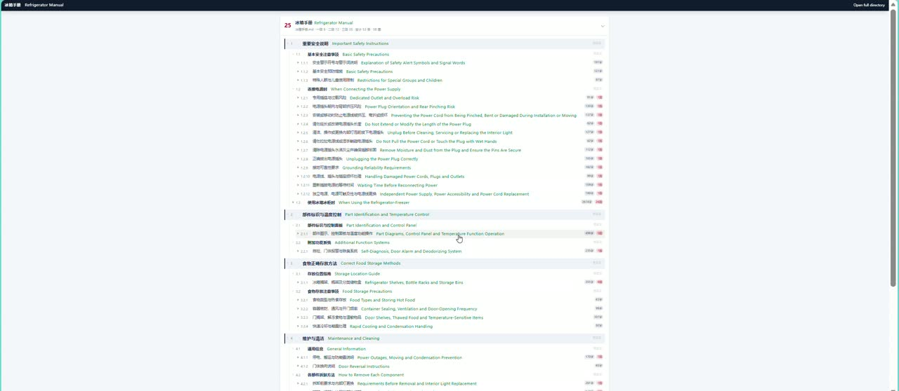<br/><sub><b>全库手册目录树（中英对照）</b></sub></td>
    <td align="center" width="33%">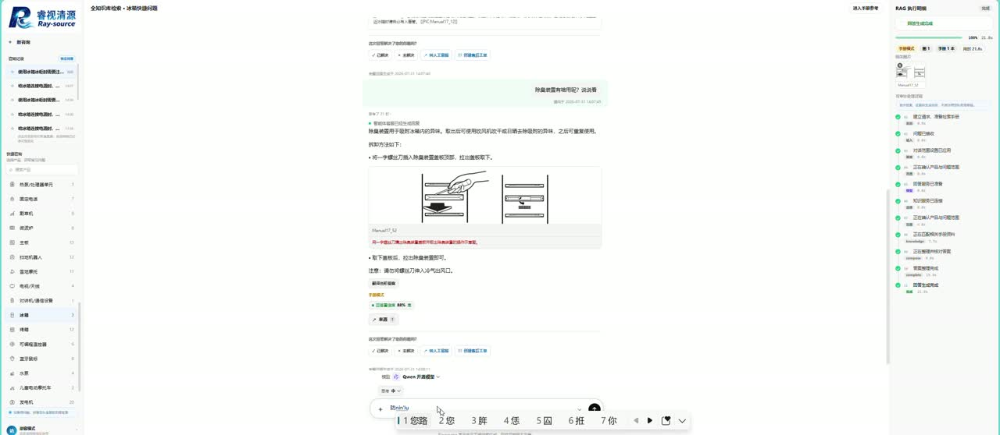<br/><sub><b>图文步骤问答</b></sub></td>
  </tr>
  <tr>
    <td align="center" width="33%">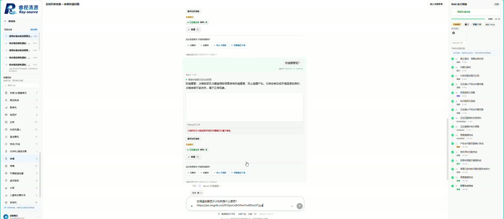<br/><sub><b>图片链接输入与理解</b></sub></td>
    <td align="center" width="33%">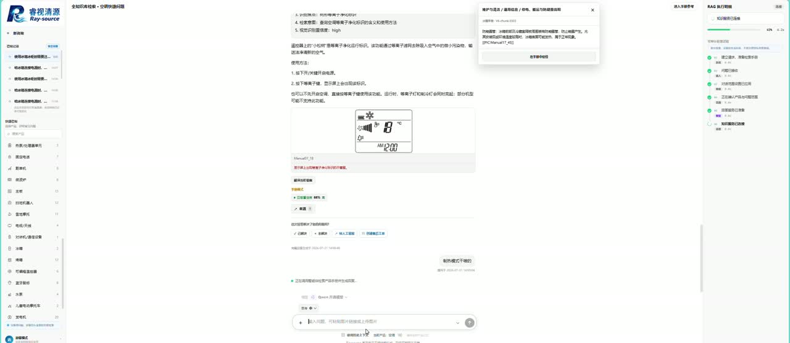<br/><sub><b>多模态部件识别</b></sub></td>
    <td align="center" width="33%">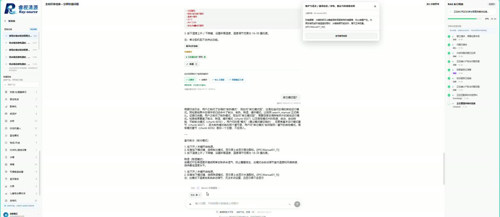<br/><sub><b>证据溯源与置信度</b></sub></td>
  </tr>
</table>
</div>

<br/>

### 移动端 PWA · 图文客服

<div align="center">
<table>
  <tr>
    <td align="center" width="50%">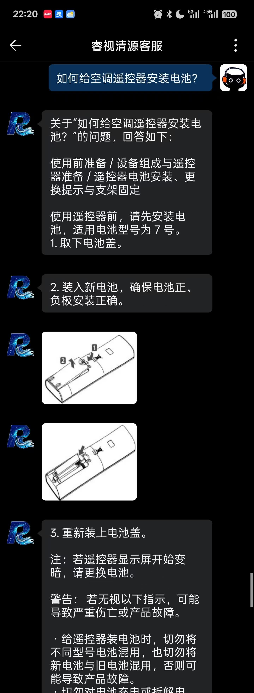</td>
    <td align="center" width="50%"></td>
  </tr>
  <tr>
    <td align="center"><sub><b>空调遥控器 · 电池安装图解</b></sub></td>
    <td align="center"><sub><b>空气净化器 · 滤网清洁图解</b></sub></td>
  </tr>
</table>
<sub>同源可安装 PWA，与桌面端共用问答、图片上传、历史会话与手册图片接口</sub>
</div>

---

## 🏗️ 系统架构

系统由两个**可独立部署**的部分组成，通过共享 Bearer Token 通信。

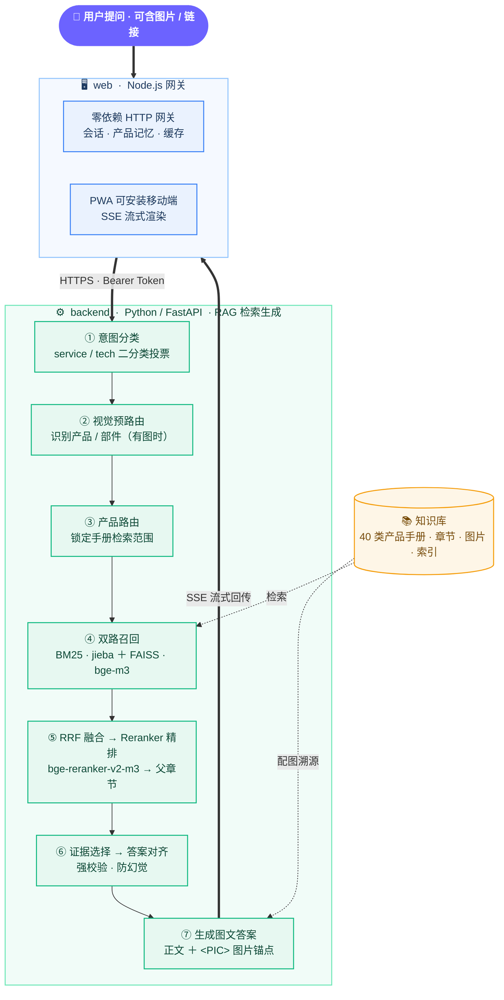

<div align="center">

**问答数据流**

`用户提问(+图片)` → `意图分类` → `视觉预路由` → `产品路由` → `BM25＋FAISS 召回` → `RRF 融合` → `Reranker 精排` → `证据对齐校验` → `生成图文答案`

</div>

**技术题 vs 客服题**

| 维度 | 客服题 `service` | 技术题 `tech` |
| :--- | :--- | :--- |
| 返回形式 | 纯文本短答 | 正文 ＋ `<PIC>` 图片锚点 ＋ 图片数组 |
| 证据校验 | 轻量 | 证据选择 ＋ 答案-证据对齐**强校验** |
| 手册配图 | 一般无 | 引用手册原图溯源 |

---

## 🧩 技术栈

| 层次 | 技术选型 |
| :--- | :--- |
| **后端服务** | Python 3.11+ · FastAPI · Uvicorn · Pydantic v2 |
| **稀疏检索** | `jieba` 分词 ＋ `rank-bm25`（BM25Okapi） |
| **稠密检索** | `BAAI/bge-m3` Embedding ＋ `FAISS`（IndexFlatIP） |
| **重排精排** | `BAAI/bge-reranker-v2-m3`（召回后对 query-doc 打分） |
| **结果融合** | RRF（Reciprocal Rank Fusion） |
| **答案生成** | OpenAI 兼容 Responses API（可替换任意大模型端点） |
| **多模态** | 视觉预路由 ＋ DINOv2 视觉相似度图片索引 |
| **网关前端** | Node.js 18+ · 零框架（内置 `node:sqlite`）· 可选 Redis |
| **移动端** | PWA（Manifest ＋ Service Worker，可安装到主屏） |
| **缓存** | 进程内 LRU ＋ 可选 Redis 跨实例检索缓存 |

---

## 🚀 快速开始

> 请先启动 `backend`（召回端），再启动 `web`（网页端）。

### 1 · 启动后端 `backend`

```bash
cd backend

python -m venv .venv
# Windows PowerShell
.\.venv\Scripts\Activate.ps1
# Linux / macOS:  source .venv/bin/activate

pip install -r requirements.txt
cp .env.example .env          # Windows: copy .env.example .env
```

在 `.env` 中至少填写：`KAFU_API_TOKEN`（自定义随机长串）、生成模型 Provider、Embedding Provider。

```bash
python -m uvicorn api_server:app --host 127.0.0.1 --port 8014 --workers 1

curl http://127.0.0.1:8014/health      # 期望返回 status: ok
```

### 2 · 启动前端 `web`

```bash
cd web
cp .env.example .env          # Windows: copy .env.example .env
```

在 `.env` 中设置 `RAGV6_API_ORIGIN` / `RAGV6_CHAT_ORIGIN` 指向后端地址；
**`RAGV6_API_TOKEN` 必须与后端 `KAFU_API_TOKEN` 完全一致。**

```bash
npm ci
node server.js
```

打开 **http://127.0.0.1:3011** —— 先发送「你好」验证客服短答，再发送一条产品问题，右侧应实时出现检索审计。

---

## 📡 API 概览

后端提供 REST / SSE 接口，均需请求头 `Authorization: Bearer <KAFU_API_TOKEN>`。

| 方法 | 路径 | 说明 |
| :--- | :--- | :--- |
| `GET`  | `/health` | 健康检查与引擎状态 |
| `POST` | `/chat` | 一次性问答（`stream:false` 返回完整 JSON） |
| `POST` | `/chat/stream` | SSE 流式问答（`status` / `delta` / `done` 事件） |
| `POST` | `/retrieve` | 只做检索、不生成答案 |
| `POST` | `/translate` | 文本翻译 |
| `*`    | `/admin/chunks/*` | 知识块管理（导入 / 预览 / 发布 / 重建 / 回滚） |

```bash
curl -sS -X POST http://127.0.0.1:8014/chat \
  -H 'Authorization: Bearer <your-token>' \
  -H 'Content-Type: application/json' \
  -d '{"question": "椅子的扶手使用一段时间后为什么会松动？", "session_id": "demo"}'
```

<sub>更多细节见 <code>backend/API.md</code>。</sub>

---

## 🛠️ 知识块管理

内置可视化知识运维后台，一键将手册导入知识库。

- **管理页面**：`http://127.0.0.1:3011/ragV6/chunk-manager/`
- **支持格式**：Markdown · TXT · DOCX · PDF
- **流程**：解析标题树 → 提取图片锚点 → 生成父章节与检索块 → 质量预检 → 事务式发布（自动备份）→ 后台重建 BM25 / FAISS → 热切换上线
- **可靠性**：重建失败自动保留旧索引服务，绝不把「文件已写入」误报为「索引已上线」

```bash
python chunk_pipeline.py "待导入/智能咖啡机.md" \
  --manual "智能咖啡机手册" --publish --rebuild-index
```

<sub>详见 <code>backend/CHUNK_MANAGER.md</code>。</sub>

---

## 📁 目录结构

```text
Ray-Source/
├── backend/                       # Python · FastAPI 检索与生成服务
│   ├── api_server.py              # 服务入口与路由（/chat /chat/stream /retrieve ...）
│   ├── agent.py                   # 核心编排：分类路由 · 检索 · 证据选择 · 答案后处理
│   ├── retrieval_engine.py        # 检索引擎：BM25 + FAISS + RRF + Rerank
│   ├── product_router.py          # 产品路由（多产品 / 分句路由）
│   ├── llm_router.py              # 大模型路由（回退 / 并发 / 流式）
│   ├── multimodal_ingest.py       # 多模态图片处理
│   ├── visual_image_index.py      # DINOv2 视觉相似度索引
│   ├── evidence_selector.py       # 证据选择
│   ├── answer_evidence_alignment.py  # 答案-证据对齐校验
│   ├── chunk_pipeline.py          # 知识块一键切分管道
│   └── API.md · CHUNK_MANAGER.md · 部署说明.md
│
├── web/                           # Node.js · 零依赖网关 + PWA + 管理后台
│   ├── server.js                  # HTTP 网关（代理 / 会话 / 缓存）
│   ├── context-packet.js          # 上下文打包
│   ├── channel-concurrency.js     # 并发通道管理
│   ├── shared-state.js            # 共享状态
│   ├── public/ragv6-ui/           # 主问答界面 + PWA
│   ├── public/chunk-manager/      # 知识块管理界面
│   └── MOBILE_APP.md · 部署说明.md
│
├── docs/assets/                   # README 展示素材（截图 / 关键帧 / GIF）
├── LICENSE                        # MIT
└── README.md
```

> ℹ️ 为保持仓库轻量，**手册图片（2600+）、FAISS / 向量索引（`.npz`）、切分数据与数据库等大文件未纳入版本控制**（见 `.gitignore`），可通过知识块管理管道重新生成。

---

## 🔒 安全说明

- 仓库不含任何真实密钥；`config_runtime.py` 与 `.env.example` 均为占位符，请替换为你自己的 Provider Key。
- `KAFU_API_TOKEN`（后端）与 `RAGV6_API_TOKEN`（前端）必须一致，且不要提交到公共仓库。
- 公网部署务必启用 HTTPS。

---

## 🏆 荣誉

<div align="center">

| 奖项 | 级别 |
| :---: | :---: |
| 中国研究生电子设计大赛（GEDC） | **国家级一等奖** |
| 企业专项奖 | **奖金 ￥40,000** |

</div>

---

<div align="center">

## 👤 作者

**Leo** &nbsp;·&nbsp; University of Electronic Science and Technology of China（电子科技大学）

[](https://github.com/UAVLLMs)
[](mailto:202522280609@std.uestc.edu.cn)

<br/>

本项目基于 [MIT License](LICENSE) 开源。

<sub>如果这个项目对你有帮助，欢迎点一个 ⭐ Star 支持！</sub>

</div>
