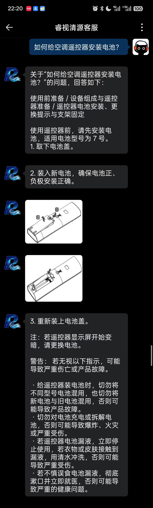
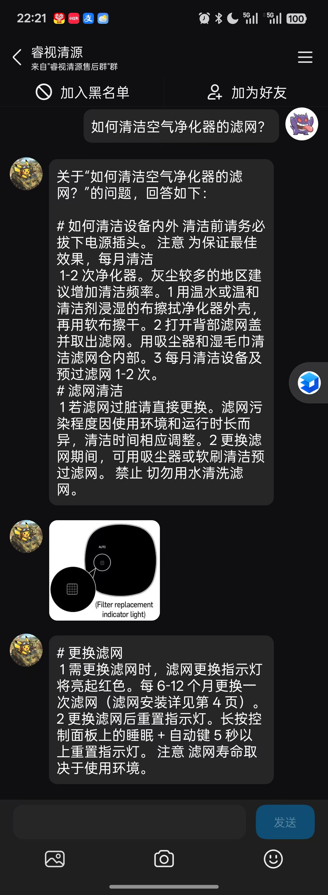

<div align="center">


# Ray-Source · 睿视清源

### 多模态检索增强（RAG）智能产品客服系统

*Multimodal Retrieval-Augmented Generation for Grounded Product Support*

<p>
  
  
</p>

<p>
  
  
  
  
  
  
  
</p>

<p>
  <b>面向真实产品说明书的图文问答 · 稀疏+稠密双路召回 · 证据对齐防幻觉 · 全链路 RAG 可视化审计</b>
</p>


</div>

---

## ✨ 项目简介

**Ray-Source（睿视清源）** 是一套可独立部署的**多模态智能产品客服系统**。它以真实的产品说明书（涵盖 **40 类家电 / 数码 / 户外设备**）为知识底座，将用户的**自然语言问题 + 上传图片**转化为**有据可依（grounded）**的图文答案：答案中的每一段结论都可追溯到手册原文与手册配图，右侧执行明细面板实时展示完整的 RAG 检索链路。

> 🏆 本项目荣获 **中国研究生电子设计大赛（GEDC）国家级一等奖**，并获 **企业专项奖金 ¥40,000**。

### 为什么是它

- **不编造**：技术题答案强制经过*证据选择*与*答案—证据对齐*校验，抑制大模型幻觉。
- **看得见**：网页端右侧「RAG 执行明细」逐步展示预检索、召回、重排、证据置信度等全过程。
- **多模态**：支持上传图片、粘贴图片链接，先做视觉预路由识别产品与部件，再由手册检索证据验证结论。
- **可运维**：内置知识块可视化管理后台，支持一键导入 / 切分 / 质量预检 / 事务发布 / 后台重建索引 / 热切换 / 回滚。
- **能落地**：前后端完全解耦、可独立部署；网页端零框架依赖；移动端为同源可安装 PWA。

---

## 🖼️ 界面预览

### 桌面网页端 · 图文问答 + RAG 全链路审计
<div align="center">
  
</div>

左侧为产品导航与会话历史，中部为带手册配图与 `<PIC>` 锚点的图文答案，右侧「RAG 执行明细」实时展示检索、重排与证据溯源。

### 关键帧速览（自演示视频抽取）

<div align="center">

| 实时检索与执行明细 | 全库手册目录树（中英对照） | 图文步骤问答 |
|:---:|:---:|:---:|
|  |  |  |
| **图片链接输入与理解** | **多模态部件识别** | **证据溯源与置信度** |
|  |  |  |

</div>

### 移动端 PWA · 图文客服

<div align="center">
  
  &nbsp;&nbsp;
  
</div>

---

## 🏗️ 系统架构

```text
┌───────────────────────────┐          ┌────────────────────────────────────────────┐
│        网页端 (Node.js)     │  HTTPS   │              召回端 (Python / FastAPI)        │
│  ───────────────────────  │  Bearer  │  ──────────────────────────────────────────  │
│  · 零依赖 HTTP 网关         │ ───────► │  意图分类 (service / tech 二分类投票)          │
│  · 会话 / 产品记忆          │  Token   │        │                                      │
│  · 推荐答案缓存             │          │        ▼   有图 → 视觉预路由 (产品/部件识别)     │
│  · SSE 流式转发             │          │  产品路由 (锁定手册范围)                        │
│  · PWA 可安装移动端         │          │        │                                      │
│  · 知识块管理后台           │ ◄─────── │        ▼                                      │
│                            │   SSE    │  双路召回  BM25(jieba)  +  FAISS(bge-m3)       │
└───────────────────────────┘          │        │        RRF 融合                        │
                                        │        ▼                                      │
                                        │  Reranker 精排 (bge-reranker-v2-m3) → 父章节   │
                                        │        │                                      │
                                        │        ▼                                      │
                                        │  证据选择 → 答案-证据对齐校验 (防幻觉)          │
                                        │        │                                      │
                                        │        ▼                                      │
                                        │  生成答案 + <PIC> 图片锚点 + 多语言一致性守卫    │
                                        └────────────────────────────────────────────┘
```

### 问答数据流

```
用户提问 (+可选图片/图片链接)
   → 意图分类（客服题 service / 技术题 tech）
   → 若含图片：视觉预路由（识别产品、可见部件、检索意图）
   → 产品路由（将检索边界锁定到对应手册）
   → BM25 稀疏召回 + FAISS 稠密召回 → RRF 融合
   → Reranker 精排 → 命中 chunk 展开为完整父章节
   → 证据选择 / 答案-证据对齐校验（抑制编造）
   → 生成最终答案：正文 + <PIC> 图片锚点 + 末尾图片数组
```

**技术题 vs 客服题**
| | 客服题 (service) | 技术题 (tech) |
|---|---|---|
| 返回 | 纯文本短答 | 正文 + `<PIC>` 图片锚点 + 图片数组 |
| 校验 | 轻量 | 证据选择 + 答案-证据对齐强校验 |
| 图片 | 一般无 | 引用手册原图 |

---

## 🧩 技术栈

| 层次 | 技术 |
|---|---|
| **召回端** | Python 3.11+ · FastAPI · Uvicorn · Pydantic v2 |
| **稀疏检索** | `jieba` 分词 + `rank-bm25` (BM25Okapi) |
| **稠密检索** | `BAAI/bge-m3` Embedding + `FAISS` (IndexFlatIP) |
| **重排** | `BAAI/bge-reranker-v2-m3`（召回后对 query-doc 对打分） |
| **融合** | RRF（Reciprocal Rank Fusion） |
| **生成** | OpenAI 兼容 Responses API（可替换任意大模型端点） |
| **多模态** | 视觉预路由 + DINOv2 视觉相似度图片索引 |
| **网页端** | Node.js 18+ · 零框架（内置 `node:sqlite`）· 可选 Redis |
| **移动端** | PWA（manifest + Service Worker，可安装到主屏） |
| **缓存** | 进程内 LRU + 可选 Redis 跨实例检索缓存 |

---

## 🚀 快速开始

> 系统由两个可独立部署的部分组成：**召回端（Python）** 与 **网页端（Node.js）**。请先启动召回端，再启动网页端。

### 1. 召回端（Python）

```bash
cd 01-召回端*/召回端

# 创建虚拟环境
python -m venv .venv
# Windows PowerShell
.\.venv\Scripts\Activate.ps1
# Linux / macOS
# source .venv/bin/activate

pip install -r requirements.txt

# 配置环境变量：复制示例并填入你自己的 Provider Key / Token
cp .env.example .env      # Windows: copy .env.example .env
```

在 `.env` 中至少填写：`KAFU_API_TOKEN`（自定义随机长串）、生成模型 Provider、Embedding Provider；启用重排则填写 Rerank Provider。

```bash
# 启动（示例端口 8014）
python -m uvicorn api_server:app --host 127.0.0.1 --port 8014 --workers 1
# 或使用脚本
./start.ps1 -ListenHost 0.0.0.0 -Port 8014
```

健康检查：

```bash
curl http://127.0.0.1:8014/health   # 期望返回 status: ok
```

### 2. 网页端（Node.js）

```bash
cd 02-网页端*/网页端

cp .env.example .env      # Windows: copy .env.example .env
```

在 `.env` 中设置：`RAGV6_API_ORIGIN` / `RAGV6_CHAT_ORIGIN` 指向召回端地址；**`RAGV6_API_TOKEN` 必须与召回端 `KAFU_API_TOKEN` 完全一致**。

```bash
npm ci
./start.ps1               # 或 node server.js
```

打开浏览器访问 **http://127.0.0.1:3011**，先发送「你好」验证客服短答，再发送一条产品问题，右侧应实时出现检索审计。

---

## 📡 API 概览

召回端对外提供 REST / SSE 接口（均需 `Authorization: Bearer <KAFU_API_TOKEN>`）：

| 方法 | 路径 | 说明 |
|---|---|---|
| `GET`  | `/health` | 健康检查与引擎状态 |
| `POST` | `/chat` | 一次性问答（`stream:false` 返回完整 JSON） |
| `POST` | `/chat/stream` | SSE 流式问答（`status` / `delta` / `done` 事件） |
| `POST` | `/retrieve` | 只做检索、不生成答案 |
| `POST` | `/translate` | 文本翻译 |
| `*`    | `/admin/chunks/*` | 知识块管理（导入 / 预览 / 发布 / 重建 / 回滚） |

请求示例：

```bash
curl -sS -X POST http://127.0.0.1:8014/chat \
  -H 'Authorization: Bearer <your-token>' \
  -H 'Content-Type: application/json' \
  -d '{"question": "椅子的扶手使用一段时间后为什么会松动？", "session_id": "demo"}'
```

> 更多细节见 `01-召回端*/召回端/API.md`。

---

## 🛠️ 知识块管理（Chunk Manager）

内置可视化知识运维后台，支持一键将手册导入知识库：

- 管理页面：`http://127.0.0.1:3011/ragV6/chunk-manager/`
- 支持格式：Markdown / TXT / DOCX / PDF
- 流程：**解析标题树 → 提取图片锚点 → 生成父章节与检索块 → 质量预检 → 事务式发布（自动备份）→ 后台重建 BM25/FAISS → 热切换上线**
- 失败自动保留旧索引服务，绝不把「文件已写入」误报为「索引已上线」

```bash
# 命令行发布并重建索引
python chunk_pipeline.py "待导入/智能咖啡机.md" \
  --manual "智能咖啡机手册" --publish --rebuild-index
```

> 详见 `01-召回端*/召回端/CHUNK_MANAGER.md`。

---

## 📁 目录结构

```
Ray-Source/
├── 01-召回端/召回端/            # Python · FastAPI 检索与生成服务
│   ├── api_server.py            # 服务入口与路由（/chat /chat/stream /retrieve ...）
│   ├── agent.py                 # 核心编排：分类路由、检索、证据选择、答案后处理
│   ├── retrieval_engine.py      # 检索引擎：BM25 + FAISS + RRF + Rerank
│   ├── product_router.py        # 产品路由（多产品 / 分句路由）
│   ├── llm_router.py            # 大模型路由（回退 / 并发 / 流式）
│   ├── multimodal_ingest.py     # 多模态图片处理
│   ├── visual_image_index.py    # DINOv2 视觉相似度索引
│   ├── evidence_selector.py     # 证据选择
│   ├── answer_evidence_alignment.py  # 答案-证据对齐校验
│   ├── chunk_pipeline.py        # 知识块一键切分管道
│   ├── chunk_admin_api.py       # 知识块管理 API
│   └── API.md / CHUNK_MANAGER.md / 部署说明.md
│
├── 02-网页端/网页端/            # Node.js · 零依赖网关 + PWA + 管理后台
│   ├── server.js                # HTTP 网关（代理 / 会话 / 缓存）
│   ├── context-packet.js        # 上下文打包
│   ├── channel-concurrency.js   # 并发通道管理
│   ├── shared-state.js          # 共享状态
│   ├── recommended-answer-cache.js
│   ├── public/ragv6-ui/         # 主问答界面 + PWA
│   ├── public/chunk-manager/    # 知识块管理界面
│   └── MOBILE_APP.md / 部署说明.md
│
├── docs/assets/                 # README 展示素材（截图 / 关键帧 / GIF）
├── LICENSE                      # MIT
└── README.md
```

> ℹ️ 为保持仓库轻量，**手册图片（2600+）、FAISS/向量索引（`.npz`）、切分数据与数据库等大文件未纳入版本控制**（见 `.gitignore`）。可通过知识块管理管道重新生成。

---

## 🔒 安全说明

- 仓库内不含任何真实密钥；`config_runtime.py` 与 `.env.example` 中均为占位符，请替换为你自己的 Provider Key。
- `KAFU_API_TOKEN`（召回端）与 `RAGV6_API_TOKEN`（网页端）必须一致，且不要提交到公共仓库。
- 公网部署务必启用 HTTPS。

---

## 🏆 荣誉

<div align="center">

| 奖项 | 级别 |
|---|---|
| 中国研究生电子设计大赛（GEDC） | **国家级一等奖** |
| 企业专项奖 | **奖金 ¥40,000** |

</div>

---

## 👤 作者

**Leo** ·  University of Electronic Science and Technology of China（电子科技大学）

- GitHub: [@UAVLLMs](https://github.com/UAVLLMs)
- Email: 202522280609@std.uestc.edu.cn

## 📄 许可证

本项目基于 [MIT License](LICENSE) 开源。

---

<div align="center">
<sub>如果这个项目对你有帮助，欢迎点一个 ⭐ Star 支持！</sub>
</div>
